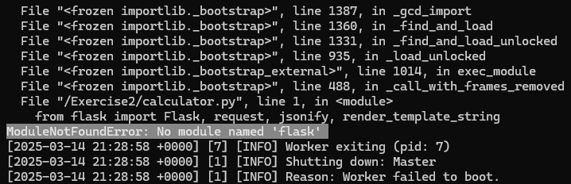
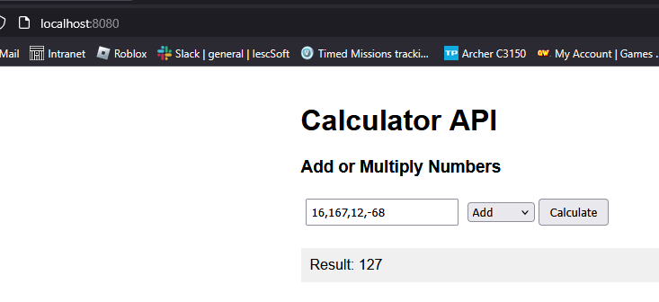
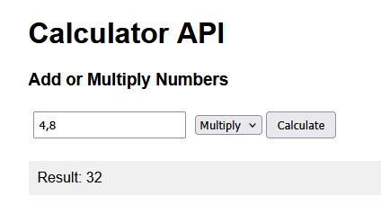
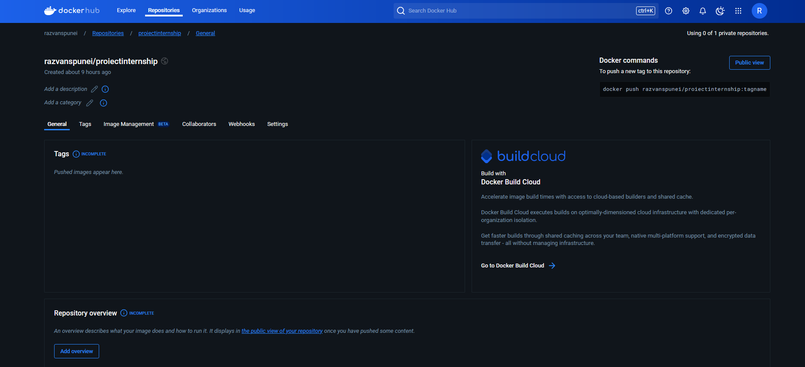
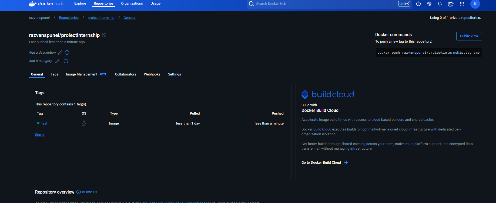
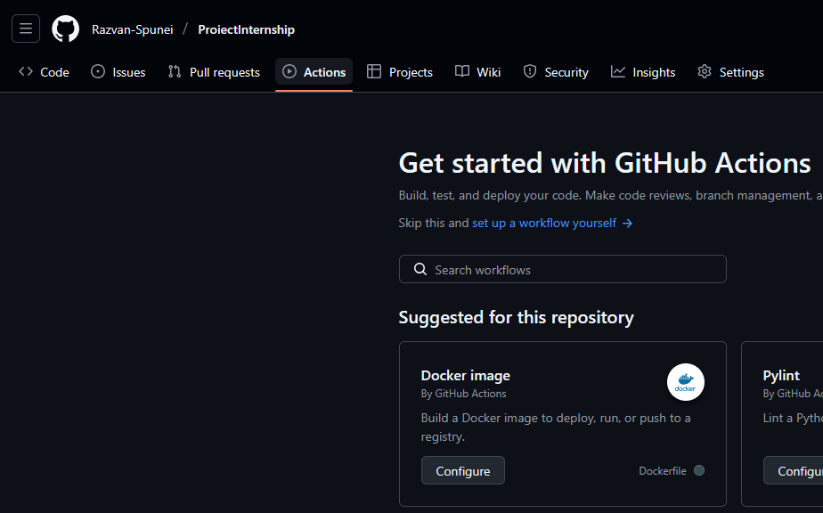
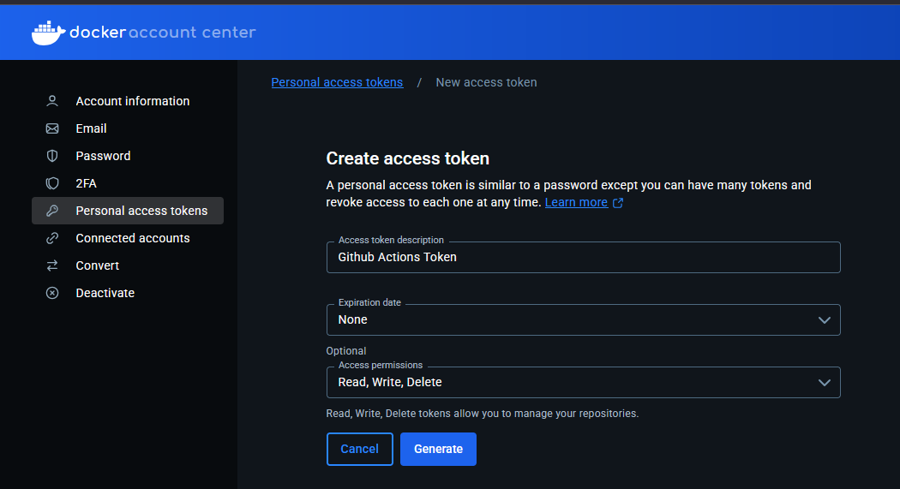
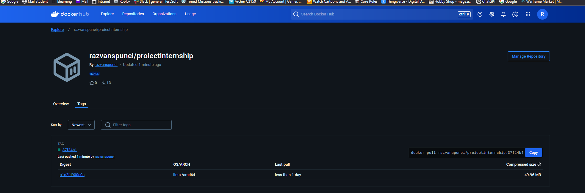
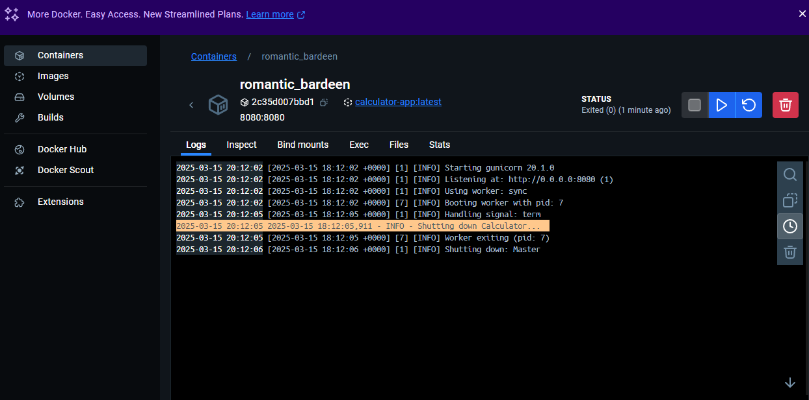

# Exercise 2


Choose one of the applications in the folder. Containerize it with Docker and automate the build and push processes. 
To complete this task, the following recommendations are provided:

# 1. Choose an application:

I have chosen to proceed with the Python application (calculator.py). I have downloaded them, and included them in my GitHub repo, in this folder.
The requirements are listed inside of requirements.txt.

QUICK NOTE: I have looked at the code of the application, and noticed it uses `flask` but it is not in `requirements.txt`, and because of that, it crashed the app when I tried to build it, so I have added it to `requirements.txt`
Also, the folder `.github` is needed for the Automation part of this exercise, however, it needs to be placed in the root folder, instead of the folder for this exercise.



# 2. Create a Dockerfile:

I have created the Dockerfile and placed it in the same folder as the requirements and the app:

```
FROM python:3.13.0a4-slim-bullseye

WORKDIR /Exercise2

COPY . /Exercise2

RUN pip install --no-cache-dir -r requirements.txt

EXPOSE 8080

CMD ["gunicorn", "-b", "0.0.0.0:8080", "calculator:app"]
```

Some notes:
1. I have chosen that particular python version, as I have seen on Dockerhub that the newest version appeared to have failed some checks, so in order to not risk the app not working, I went with the previous version
2. I used `EXPOSE 8080` for the port to be usuable
3. Since `gunicorn` was one of the requirements in the text file, I have used that, to run the application, with the `-b` argument to bind the port.


# 3. Local Testing:

Building the image locally:

```
PS C:\Users\Shadow\Desktop\ProiectInternship\ProiectInternship\Exercise2> docker build -t calculator-app .
[+] Building 5.0s (10/10) FINISHED                                                                 docker:desktop-linux
 => [internal] load build definition from Dockerfile                                                               0.0s
 => => transferring dockerfile: 247B                                                                               0.0s
 => [internal] load metadata for docker.io/library/python:3.13.0a4-slim-bullseye                                   1.0s
 => [auth] library/python:pull token for registry-1.docker.io                                                      0.0s
 => [internal] load .dockerignore                                                                                  0.0s
 => => transferring context: 2B                                                                                    0.0s
 => [1/4] FROM docker.io/library/python:3.13.0a4-slim-bullseye@sha256:f69a0965c4c667a897c67105a8f1dccfbdad69d9e60  0.0s
 => [internal] load build context                                                                                  0.0s
 => => transferring context: 51.65kB                                                                               0.0s
 => CACHED [2/4] WORKDIR /Exercise2                                                                                0.0s
 => [3/4] COPY . /Exercise2                                                                                        0.0s
 => [4/4] RUN pip install --no-cache-dir -r requirements.txt                                                       3.7s
 => exporting to image                                                                                             0.2s
 => => exporting layers                                                                                            0.1s
 => => writing image sha256:2cecdd49bb0dc39ab26833bd02d5d6e4b19e3dd7fce93b0167a1498294b9c5f2                       0.0s
 => => naming to docker.io/library/calculator-app                                                                  0.0s
```

Running the image:

```
PS C:\Users\Shadow\Desktop\ProiectInternship\ProiectInternship\Exercise2> docker run -p 8080:8080 calculator-app
[2025-03-14 21:35:04 +0000] [1] [INFO] Starting gunicorn 20.1.0
[2025-03-14 21:35:04 +0000] [1] [INFO] Listening at: http://0.0.0.0:8080 (1)
[2025-03-14 21:35:04 +0000] [1] [INFO] Using worker: sync
[2025-03-14 21:35:04 +0000] [7] [INFO] Booting worker with pid: 7
```

Testing the image:

I have entered "localhost:8080" in my browser, to access the app.

The app works by inputting numbers separated by commas, then selecting either multiply/add, and clicking the "Calculate" button:





To close the app, I used the command `docker ps` to see all active containers, then I used `docker stop` followed by the ID of the container, to stop it.
To view more details, we can use the `docker logs` command, followed by the ID of the container, to see all the logs related to it.

```
PS C:\Users\Shadow> docker logs 53752819611d
[2025-03-14 22:08:26 +0000] [1] [INFO] Starting gunicorn 20.1.0
[2025-03-14 22:08:26 +0000] [1] [INFO] Listening at: http://0.0.0.0:8080 (1)
[2025-03-14 22:08:26 +0000] [1] [INFO] Using worker: sync
[2025-03-14 22:08:26 +0000] [7] [INFO] Booting worker with pid: 7
```

# 4. Set Up a Docker Registry:

Created an account on Docker Hub, then created the repository:



To push the image to the repo, I tagged the image as "test", I logged in to docker, then I pushed it to the repo:

```
PS C:\Users\Shadow> docker tag calculator-app razvanspunei/proiectinternship:test
PS C:\Users\Shadow> docker login
Authenticating with existing credentials...
Login Succeeded
PS C:\Users\Shadow> docker push razvanspunei/proiectinternship:test
The push refers to repository [docker.io/razvanspunei/proiectinternship]
c4d658f33c53: Pushed
eee5a417381f: Pushed
ea9234c93ec2: Pushed
ff331540e912: Mounted from library/python
e655292d3eb9: Mounted from library/python
07e75ca20fee: Mounted from library/python
3ddd373c9e01: Mounted from library/python
3c8879ab2cf2: Mounted from library/python
test: digest: sha256:2e35ab3dde2f7adcdcd3a7a44347fccb07279f989224350ac8ef1604c841ac0e size: 1996
```

How it appears after the push:




# 5. Automation:

For automation, I have to use GitHub Actions. To do this, I need a `.github` folder, in the root directory of my repo, which contains `workflow` folder, and inside it, an `.yml` file where the instructions themselves go.
On the GitHub repo itself, there is a button on the top bar, called "Actions". Upon clicking on it I was greeted with a menu which had various options based on what I wanted to do, so I chose the "Docker Image" option.



In `docker-image.yml`, Github autocreated this code below:

```
name: Docker Image CI

on:
  push:
    branches: [ "main" ]
  pull_request:
    branches: [ "main" ]

jobs:

  build:

    runs-on: ubuntu-latest

    steps:
    - uses: actions/checkout@v4
    - name: Build the Docker image
      run: docker build . --file Dockerfile --tag my-image-name:$(date +%s)
```

I had to pull the new folders and file created to the project on my PC, so I can then work on the file:

`git pull origin main`

I then headed in GitHub to Settings/Secrets and Variables/Actions, and added the following repository secrets, which will be needed later:

```
DOCKER_USERNAME - I set this to razvanspunei
DOCKER_TOKEN - An access token I have generated and given permission to edit/write/delete
```
The token was generated in this menu in Docker Hub, in the account page:



After that, I have modified the `docker-image.yml` as follows:

- Removed `pull_request: branches: [ "main" ` as instructions say to trigger the build when changes are pushed, not necessarily on pull
- Added the following to login into Docker Hub, so I can access my repo and build there:

```
    - name: Log in to Docker Hub
      uses: docker/login-action@v3
      with:
        username: ${{ secrets.DOCKER_USERNAME }}
        password: ${{ secrets.DOCKER_TOKEN }}
```

- Using the following to extract the commit hash from git:

```
    - name: Extract commit hash
      run: echo "COMMIT_HASH=$(git rev-parse --short HEAD)" >> $GITHUB_ENV
```

- This builds the Docker image, with the proper tag:

```
    - name: Build the Docker image
      run: docker build ./Exercise2 --file ./Exercise2/Dockerfile --tag proiectinternship:${{ env.COMMIT_HASH }}
```

- This pushes the Docker Image, to the Docker registry:

```
    - name: Push to Docker Hub
      run: docker tag proiectinternship:${{ env.COMMIT_HASH }} ${{ secrets.DOCKER_USERNAME }}/proiectinternship:${{ env.COMMIT_HASH }} &&
           docker push ${{ secrets.DOCKER_USERNAME }}/proiectinternship:${{ env.COMMIT_HASH }}

```

- Upon pushing the changes to Github, the `docker-image.yml` was automatically called, and I could see next to the name a yellow circle showing that it is in progress. After a couple seconds it turned into a green checkmark, and upon checking Docker Hub, I could see that the image was successfully built and pushes:



Full code for the `docker-image.yml` below:

```
name: Docker Image CI

on:
  push:
    branches: [ "main" ]

jobs:
  build:
    runs-on: ubuntu-latest

    steps:
    - name: Check out the repository
      uses: actions/checkout@v4

    - name: Log in to Docker Hub
      uses: docker/login-action@v3
      with:
        username: ${{ secrets.DOCKER_USERNAME }}
        password: ${{ secrets.DOCKER_TOKEN }}

    - name: Extract commit hash
      run: echo "COMMIT_HASH=$(git rev-parse --short HEAD)" >> $GITHUB_ENV

    - name: Build the Docker image
      run: docker build ./Exercise2 --file ./Exercise2/Dockerfile --tag proiectinternship:${{ env.COMMIT_HASH }}

    - name: Push to Docker Hub
      run: docker tag proiectinternship:${{ env.COMMIT_HASH }} ${{ secrets.DOCKER_USERNAME }}/proiectinternship:${{ env.COMMIT_HASH }} &&
           docker push ${{ secrets.DOCKER_USERNAME }}/proiectinternship:${{ env.COMMIT_HASH }}
```

# Bonus / Nice to have:

## B1. Ensure the application catches the Docker container's stop signal and performs a clean shutdown

For this, the Python app would need to be modified, to include a function to catch the stop signal from Docker.\
I have added these 3 imports, so I can access the signal, as well as the function to shut down the program, and get some logs to make sure it does shut down:

```
import signal
import sys
import logging
```

This function shuts down the program:

```
def shutdown(sig, frame):
    app.logger.info("Shutting down Calculator...")
    sys.exit(0)
```

This sets up the format for logging:

```
logging.basicConfig(
    level=logging.INFO,
    format='%(asctime)s - %(levelname)s - %(message)s',
)
```

And this checks for the signal, to trigger the shutdown:
`signal.signal(signal.SIGTERM, shutdown)`



## B2. Configure environment variables for sensitive information
