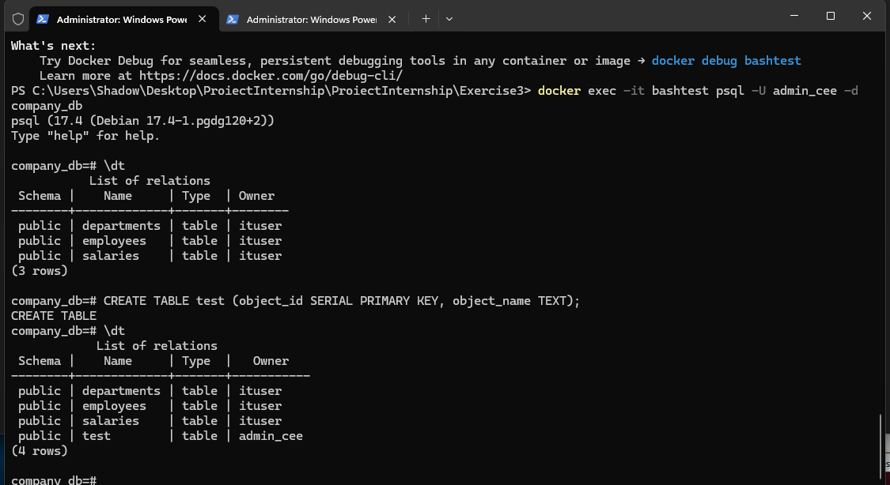
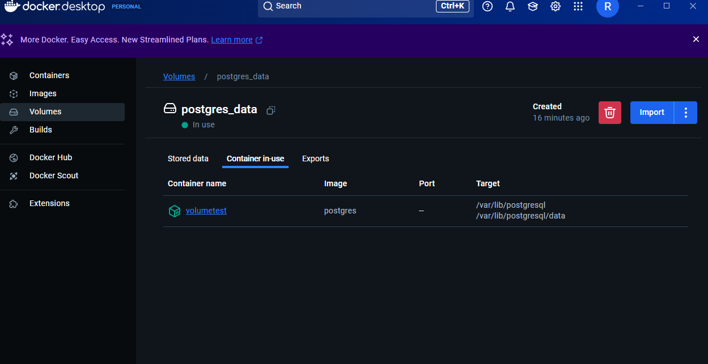

# Exercise 3

PostgreSQL Container with Data Import and Queries 

# Pull and run a PostgreSQL container.

To pull the container, I just had to use in terminal
`docker pull postgres`

And to run it I used:

`docker run --name postgres -e POSTGRES_USER=ituser -e POSTGRES_PASSWORD=pass -e POSTGRES_DB=company_db -p 5432:5432 -d postgres`

The `-e` reffers to environment variables, and I used it to pass the user, password, and name of the database, as well as the port it should run on. I used the port 5432 because that is what postgresql usually uses by default.
The `-d` is for detached mode, so I can keep using the same terminal. If I want to close it, I can just use `docker ps` to find the ID, and then stop it.

#	Create a dataset using the sql script provided in the folder 3-db/

To run the script, I have used this command:

`docker exec -i postgres psql -U ituser -d company_db < populatedb.sql`

NOTE: while running this inside of PowerShell, I have encountered the following error (due to the '<' operator, which is used by PowerShell for something else):

```
At line:1 char:54
+ docker exec -i postgres psql -U ituser -d company_db < populatedb.sql
+                                                      ~
The '<' operator is reserved for future use.
    + CategoryInfo          : ParserError: (:) [], ParentContainsErrorRecordException
    + FullyQualifiedErrorId : RedirectionNotSupported
```

After running the script in CMD, it has worked, but I have gotten an error on screen:

```
ERROR:  syntax error at or near "USE"
LINE 1: USE company_db;
        ^
CREATE TABLE
CREATE TABLE
CREATE TABLE
INSERT 0 8
INSERT 0 53
ERROR:  insert or update on table "salaries" violates foreign key constraint "salaries_employee_id_fkey"
DETAIL:  Key (employee_id)=(54) is not present in table "employees".
```

What this tells me, is that there are more salaries then employees in the table. Upon connecting to the database (process that I have detailed in the next step) I have noticed that the database was actually populated, despite the error.
The problem is, the Salaries table was not populated at all, so I had to come up with a fix.
I have modified the `INSERT INTO salaries` block, `in the populatedb.sql` script provided, with the following:

```
INSERT INTO salaries (employee_id, salary)
SELECT e.employee_id, s.salary
FROM (VALUES
<salaries here>
) AS s(employee_id, salary)
JOIN employees e ON e.employee_id = s.employee_id;
```

Which should make it so that upon running the script, it will only write the salaries for the employees that exits, and ignore the rest, instead of not writing anything.
I proceeded to delete the database, and redo it. I stopped the container, removed it, and pruned the volume, to make sure I have a clean start.

```
docker stop postgres
docker rm postgres
docker volume prune
```

After this I have just re-created the database, and ran the script in CMD.
It still returned this error:

```
ERROR:  syntax error at or near "USE"
LINE 1: USE company_db;
        ^
CREATE TABLE
CREATE TABLE
CREATE TABLE
INSERT 0 8
INSERT 0 53
INSERT 0 53
```

However, it populated the database properly this time. The other times, salaries would not be populated. With this fix, it worked as intended.


#	Run the following SQL queries: 

I have used this command to access the database:

`docker exec -it postgres psql -U ituser -d company_db`

Where, `-it` is used to activate the terminal, `psql` is the PostgreSQL command line tool, then we have the user, and the database we want to connect to.

 By writing `\dt` in the commands, I could see a list of all the tables in the database:
 
```
company_db=# \dt
           List of relations
 Schema |    Name     | Type  | Owner
--------+-------------+-------+--------
 public | departments | table | ituser
 public | employees   | table | ituser
 public | salaries    | table | ituser
(3 rows)
```


##	Find the total number of employees.

To find the total number of employees:

`SELECT COUNT(*) FROM employees;`

This returned:
```
 count
-------
    53
```

I wanted to check the salaries as well, and noticed there was nothing there. However, after I have performed the fix mentioned above, there were 53 salaries.

##	Retrieve the names of employees in a specific department (prompt for user input). 

To do this, I wrote the command:

`SELECT first_name, last_name FROM employees WHERE department_id = (SELECT department_id FROM departments WHERE department_name = 'IT');`

It has displayied on screen:

```
 first_name | last_name
------------+-----------
 Bob        | Johnson
 Charlie    | Brown
 Hannah     | Martinez
 Noah       | Lewis
 Liam       | Clark
 Emma       | Davis
 Olivia     | Taylor
 Lucas      | Baker
 Ava        | Evans
 William    | Nelson
(10 rows)
```
That command can look for any department we need, in my case, I have asked it for the "IT" department. If we look into the department table:

`SELECT * FROM departments;`

We can just choose a name from there, and write it into the command mentioned above.

##	Calculate the highest and lowest salaries per department. 

```
SELECT 
    d.department_name,
    MAX(s.salary) AS highest_salary,
    MIN(s.salary) AS lowest_salary
FROM 
    departments d
JOIN employees e ON e.department_id = d.department_id
JOIN salaries s ON s.employee_id = e.employee_id
GROUP BY d.department_name;
```
I have requested the department name, minimum salary and maximum salary from the table. To access the salaries, I had to join employees based on department id, to the department, then the salaries to the employees, based on the employee ID.
Which resulted in me having access to all the salaries for that department.
After running. the command returned this:

```
 department_name  | highest_salary | lowest_salary
------------------+----------------+---------------
 Customer Support |      119000.00 |     109000.00
 Marketing        |       91000.00 |      78000.00
 Operations       |      131000.00 |     121000.00
 Sales            |      107000.00 |      93000.00
 Legal            |      143000.00 |      91000.00
 IT               |       94000.00 |      67000.00
 Finance          |       76000.00 |      62000.00
 HR               |       60000.00 |      50000.00
(8 rows)
```


#	Dump the dataset into a file. 

I have noticed that PostgreSQL has a function to dump the dataset. Since it is a Docker container, I used the following command to open an interactive shell:

`docker exec -it postgres bash`

After that, I have run the `pg_dump` command to create the dump, with argument for the user, and I have placed it inside the "tmp" folder.

`pg_dump -U ituser company_db > /tmp/company_db_dump.sql`

After that, in a different terminal, I have accessed the container through docker to copy the file from the container to the folder of the exercise (I already had my terminal open there):

`docker cp postgres:/tmp/company_db_dump.sql ./company_db_dump.sql`

The dump looks like this:


#	Write a Bash script that: 

Created a couple of variables to help with the script.

```
DB_NAME="company_db"
DB_USER="ituser"
DB_ADMIN_USER="admin_cee"
DB_PASSWORD="pass"
DUMP_FILE="./company_db_dump.sql"
LOG_FILE="./query_results.log"
```

##	Automates the database creation process. 

I will first create a new container, with a new name, so we can have a clean start.

```
echo "Creating Container"
docker run --name bashtest -e POSTGRES_USER=$DB_USER -e POSTGRES_PASSWORD=$DB_PASSWORD -e POSTGRES_DB=$DB_NAME -d postgres
```
Creating the container with this also creates our database.
Also, I have noticed an error that happens with the part of the code creating the admin:

```
$ ./setup.sh
Starting database setup
Creating Container
cf1dc4c79cf1d57ff86743998df1bb820717b31ddd22a4fe069fac11f588e4fe
Creating database
psql: error: connection to server on socket "/var/run/postgresql/.s.PGSQL.5432" failed: No such file or directory
        Is the server running locally and accepting connections on that socket?
Creating second admin user
psql: error: connection to server on socket "/var/run/postgresql/.s.PGSQL.5432" failed: FATAL:  database "company_db" does not exis
```

Upon closer inspection I have determined that the script attempts to perform operations in the database, before the container is actually started. To fix this, I have implemented this bit of code:

```
echo "Waiting for PostgreSQL to start..."
until docker exec -i $CONTAINER_NAME psql -U $DB_USER -d postgres -c "SELECT 1;" &>/dev/null; do
  sleep 1
done
echo "PostgreSQL is up and running!"
```

What this does is it makes the script wait until it see that the container is up and running. It checks so every 1 second. The `SELECT 1` instruction would always return 1. If the container would not be running, it would result in an error.
This bit `&>/dev/null;` will silence the errors so they would not appear on screen every check. After adding this, the following parts worked without any issues.

##	Creates a second admin user called "admin_cee" 

I used this command to create the second admin. I have basically connected as "ituser", to the database, and with `-c` I executed the command after it:

```
echo "Creating second admin user"
docker exec -i $CONTAINER_NAME psql -U $DB_USER -d $DB_NAME -c "CREATE ROLE $DB_ADMIN_USER WITH SUPERUSER CREATEDB CREATEROLE LOGIN PASSWORD '$DB_PASSWORD';"
```

The part after the `-c` argument is an SQL command that will create the role with the name "admin_cee", who is a superuser, and allowed to create roles, databases, and is allowed to login.

##	Imports the dataset created at Step 4. 

I used the following command to import the dump and use it for the database:

```
echo "Importing dataset from $DUMP_FILE"
docker exec -i $CONTAINER_NAME psql -U $DB_USER -d $DB_NAME < $DUMP_FILE
```

##	Executes the queries from Step 3 and outputs the results to a log file. 

And this section of code basically runs the queries used at step 3.

```
echo "Executing queries and saving results"
docker exec -i $CONTAINER_NAME psql -U $DB_USER -d $DB_NAME -c "SELECT first_name, last_name FROM employees WHERE department_id = (SELECT department_id FROM departments WHERE department_name = 'IT');" > $LOG_FILE
docker exec -i $CONTAINER_NAME psql -U $DB_USER -d $DB_NAME -c "SELECT d.department_name, MAX(s.salary) AS highest_salary, MIN(s.salary) AS lowest_salary FROM employees e JOIN departments d ON e.department_id = d.department_id JOIN salaries s ON e.employee_id = s.employee_id GROUP BY d.department_name;" >> $LOG_FILE

echo "Database setup complete! Results saved to $LOG_FILE"
``` 

They are saved in the "query_results.log" file, which can be found in the Exercise3 folder.

I also wanted to test to see if the new admin user is created and usuable, so I have tried to login from powershell, and see if i can see the database, and it worked:



# Bonus / Nice to Have: 

# Mount a persistent volume to store PostgreSQL data.

I have created a docker volume with this command:

`docker volume create postgres_data`

After that, I used this to create a new container and mount the volume:

`docker run --name volumetest -e POSTGRES_USER=ituser -e POSTGRES_PASSWORD=pass -e POSTGRES_DB=company_db -v postgres_data:/var/lib/postgresql -d postgres`

The `-v` is used to mount the volume, "postgres_data" is the volume created above, and after is the path where PostgreSQL stores its data.
In docker desktop, it looks like this:

